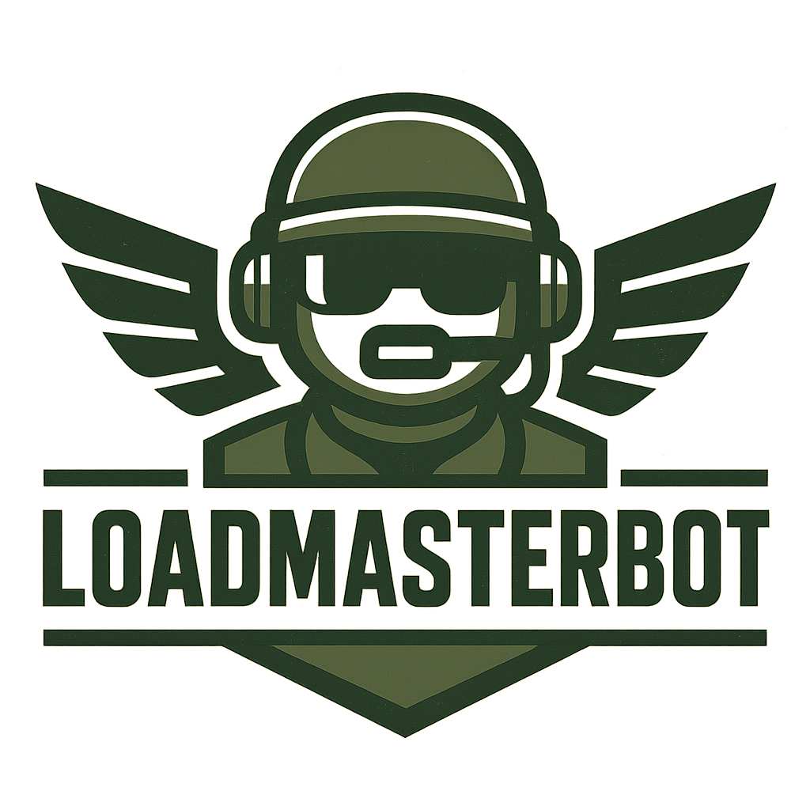

# 🎮 Arma 3 Mod Manager Discord Bot

[](https://www.python.org/downloads/)
[](https://opensource.org/licenses/MIT)
[](https://github.com/yourusername/loadmasterbot/commits/main)
[](https://discordpy.readthedocs.io/)
[](https://arma3.com/)



A powerful Discord bot designed to help Arma 3 communities manage their mod lists. The bot analyzes HTML mod lists exported from the Arma 3 Launcher and provides comprehensive insights about mods, CDLC requirements, and changes.

## ✨ Features

### 📋 Mod List Analysis
- **Automatic Mod Name Lookup**: Extracts mod IDs from HTML and fetches names from Steam Workshop
- **Size Estimation**: Estimates total download size and individual mod sizes with smart caching
- **Workshop Requirements**: Checks if all required workshop dependencies are included
- **Smart Caching**: Caches mod information to reduce API calls and improve performance

### 🔧 CDLC Compatibility Checking
- **Unified CDLC Display**: Shows all CDLC requirements in one clean section
- **Status Indicators**: Clear ✅ (Detected) and ⚠️ (Required) indicators for each CDLC
- **Smart Links**: Provides both CDLC store links and compatibility mod links as needed
- **Supported CDLC**: Global Mobilization, S.O.G. Prairie Fire, CSLA Iron Curtain, Spearhead 1944, Western Sahara, Reaction Forces, Expeditionary Forces

### 📈 Change Tracking
- **Mod List Comparison**: Compares current upload with previous uploads
- **Change Detection**: Shows added/removed mods between uploads
- **User History**: Tracks mod lists per user and server

### 📱 Mobile-Friendly Interface
- **Responsive Design**: Works great on both desktop and mobile Discord
- **Interactive Buttons**: Easy-to-use buttons for viewing complete mod lists and downloading files
- **Clean Layout**: Well-organized sections with visual separators for better readability
- **Limited Display**: Shows top 10 mods with option to view complete list privately

## 🚀 Quick Start

### Prerequisites
- Python 3.8 or higher
- Discord Bot Token
- Arma 3 Launcher (for exporting mod lists)

### Installation

The bot can either be run on a server or via a service like <a href="http://www.railway.app/">Railway.app</a> for easier deployment. 

To run it on Railway or other similar services, link this GH repository to your dashboard. 

To run the app from a server, do the following:

1. **Clone the repository**
   ```bash
   git clone <repository-url>
   cd loadmasterbot
   ```

2. **Install dependencies**
   ```bash
   pip install -r requirements.txt
   ```

3. **Set up environment variables**
   ```bash
   cp env_example.txt .env
   ```
   Edit `.env` and add your Discord bot token:
   ```
   DISCORD_TOKEN=your_discord_bot_token_here
   ```

4. **Run the bot**
   ```bash
   python discord_bot.py
   ```

### Getting a Discord Bot Token

1. Go to [Discord Developer Portal](https://discord.com/developers/applications)
2. Create a new application
3. Go to the "Bot" section
4. Create a bot and copy the token
5. Add the bot to your server with appropriate permissions

## 📖 How to Use

### For Users

1. **Export Mod List from Arma 3 Launcher**
   - Open Arma 3 Launcher
   - Go to Mods tab
   - Select your mod list
   - Click "Export" and save as HTML

2. **Upload to Discord**
   - Simply drag and drop the HTML file into your Discord channel
   - The bot will automatically process it

3. **View Results**
   - The bot will show a comprehensive analysis with clear sections
   - Use "Show All Mods" button to get the complete list sent to your private messages
   - Use "Download" button to get the original HTML file
   - Check for any CDLC requirements or workshop dependencies

### Commands

**Slash Commands (Recommended):**
- `/modlist` - Show help information
- `/bothelp` - Show detailed bot help
- `/debug` - Debug bot functionality (modsize, dlc, changes)

**Legacy Commands (Deprecated):**
- `!modlist` - Show help information (use `/modlist` instead)
- `!bothelp` - Show detailed bot help (use `/bothelp` instead)
- `!modsize_debug` - Debug mod sizes (use `/debug modsize` instead)
- `!dlc_debug <mod_id>` - Debug DLC for specific mod (use `/debug dlc <mod_id>` instead)
- `!changes_debug` - Debug change tracking (use `/debug changes` instead)

### 🧪 Testing the Bot

To test the bot locally, you can use the provided example mod list HTML files:

- **[modTestList1.html](modTestList1.html)** - Test mod list with various mods and CDLC requirements
- **[modTestList2.html](modTestList2.html)** - Alternative test mod list for comparison testing

Simply download these files and upload them to your Discord channel to see the bot in action. These files contain real mod IDs from the Steam Workshop and will demonstrate all the bot's features including:

- Mod name and size detection
- CDLC requirement checking
- Workshop dependency analysis
- Change tracking (when uploading both files)
- Interactive button functionality

## 🔧 Configuration

### CDLC Compatibility Mods

Edit `config.py` to add or modify CDLC compatibility mods:

```python
CDLC_COMPAT_MODS = {
    "GM": {
        "name": "Global Mobilization - Cold War Germany",
        "required_mods": [1808728802],  # CDLC mod IDs
        "compat_mod": 1776428269,       # Compatibility mod ID
        "compat_name": "Global Mobilization - Cold War Germany Compatibility Data",
        "steam_url": "https://steamcommunity.com/sharedfiles/filedetails/?id=1776428269",
        "cdlc_url": "https://steamcommunity.com/sharedfiles/filedetails/?id=1776428269"
    },
    # Add more CDLC here...
}
```

### Known Mod Sizes

Add known mod sizes to improve estimation accuracy:

```python
KNOWN_MOD_SIZES = {
    "123456789": 1.2,  # Mod ID: Size in GB
    "987654321": 0.8,
    # Add more mods here...
}
```

### Authorized Users

Restrict who can upload mod lists by adding Discord User IDs to the authorized users list:

```python
# Allow all users (default)
AUTHORIZED_USERS = []

# Restrict to specific users
AUTHORIZED_USERS = ["123456789", "987654321"]
```

To find a Discord User ID:
1. Enable Developer Mode in Discord (User Settings → Advanced → Developer Mode)
2. Right-click on the user's name
3. Select "Copy ID"
4. Add the ID to the `AUTHORIZED_USERS` list in `config.py`

**Note**: Leave the list empty `[]` to allow all users to upload mod lists.

## 🏗️ Architecture

### Core Components

- **`discord_bot.py`**: Main bot implementation with Discord.py and interactive UI
- **`steam_workshop.py`**: Steam Workshop API integration and HTML parsing
- **`mod_analyzer.py`**: Mod analysis, CDLC detection, and workshop requirements checking
- **`database.py`**: SQLite database for caching and user data
- **`config.py`**: Configuration and constants

### Data Flow

1. **HTML Upload** → Parse mod IDs from HTML
2. **Steam API** → Fetch mod names, sizes, and required items
3. **Analysis** → Check CDLC requirements, workshop dependencies, compare with previous uploads
4. **Database** → Cache results and store user data
5. **Discord** → Send formatted results with interactive buttons

## 🔍 Features in Detail

### Mod List Display
- Shows top 10 mods by size with clean formatting
- "Show All Mods" button sends complete list to user's private messages
- "Download" button provides original HTML file
- Sorted by size (largest first) for better organization
- Auto-deletes old mod list messages to keep channels clean

### CDLC Compatibility Checking
- **Unified Display**: All CDLC requirements shown in one organized section
- **Status Indicators**: ✅ (Detected) shows compatibility mod links, ⚠️ (Required) shows both CDLC and compatibility links
- **Smart Organization**: CDLC sorted alphabetically with clear status and appropriate links
- **User-Friendly**: Clear messaging about CDLC activation requirements

### Workshop Requirements
- **Dependency Checking**: Verifies all required workshop items are included
- **Missing Items**: Shows specific missing dependencies with mod names
- **Status Indicators**: Green checkmark for success, red warning for issues

### Size Estimation
- Uses cached mod sizes when available
- Estimates unknown mods based on average size
- Shows total estimated download size
- Updates cache with new size information

### Change Tracking
- Compares current upload with last upload
- Shows added and removed mods
- Tracks changes per user and server
- Maintains upload history

## 🛠️ Development

### Adding New Features

1. **New CDLC Support**: Add to `CDLC_COMPAT_MODS` in `config.py`
2. **New Commands**: Add to `ModCommands` class in `discord_bot.py`
3. **New Analysis**: Extend `ModAnalyzer` class in `mod_analyzer.py`

### Database Schema

```sql
-- Mod cache table
CREATE TABLE mod_cache (
    mod_id TEXT PRIMARY KEY,
    mod_name TEXT,
    mod_size REAL,
    last_updated INTEGER
);

-- User uploads table
CREATE TABLE user_uploads (
    id INTEGER PRIMARY KEY AUTOINCREMENT,
    user_id TEXT,
    server_id TEXT,
    upload_time INTEGER,
    mod_list TEXT,
    total_size REAL
);

-- Mod sizes table
CREATE TABLE mod_sizes (
    mod_id TEXT PRIMARY KEY,
    size_gb REAL,
    last_updated INTEGER
);
```

## 🤝 Contributing

1. Fork the repository
2. Create a feature branch
3. Make your changes
4. Add tests if applicable
5. Submit a pull request

## 📝 License

This project is licensed under the MIT License - see the LICENSE file for details.

## 🙏 Acknowledgments

- Discord.py community for the excellent Discord API wrapper
- Steam Workshop for providing mod information
- Arma 3 community for inspiration and feedback

## 🐛 Troubleshooting

### Common Issues

1. **Bot not responding to uploads**
   - Check bot permissions in Discord
   - Ensure bot has message content intent enabled

2. **Mod names not showing**
   - Check internet connection
   - Steam Workshop might be temporarily unavailable
   - Mod might be private or removed

3. **Database errors**
   - Ensure write permissions in bot directory
   - Check if SQLite is properly installed

4. **Private message issues**
   - Users need to allow private messages from server members
   - Check Discord privacy settings

### Logs

The bot will print status messages to console. Check for:
- Connection status
- API errors
- Database operations

## 📞 Support

For issues and questions:
1. Check the troubleshooting section
2. Review the configuration
3. Open an issue on GitHub

---

**Made for Arma 3 communities** 🎮 
